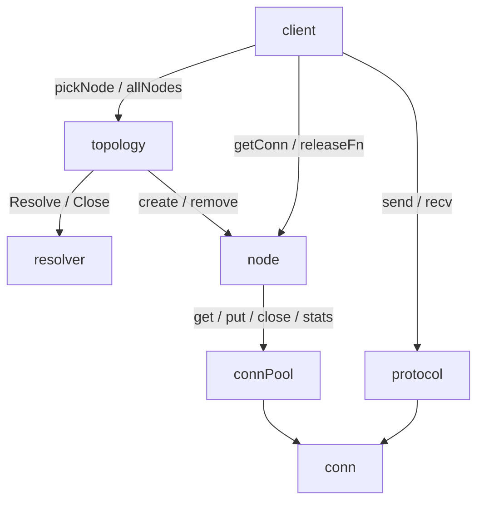

# Topology and node lifecycle

Topology isolates discovery and membership from request execution, connection
resources and protocol handling. Nodes currently have equal roles; this boundary
leaves room for primary/replica relationships and membership changes.

## Responsibilities

- `client` owns command execution, the configured Picker, request telemetry and
  concurrent broadcast execution/error aggregation.
- `topology` owns the discovery target, Resolver, attempt timeout, injected
  `makeNode(addr) *node` dependency, membership map and `cachedAddrs`. It publishes
  membership, routing inputs and source generation together under an RWMutex.
- `node` owns its immutable network/address identity, direct connection and
  authentication configuration, lifecycle and connection pool. It proxies every
  borrow and return, and initiates pool shutdown.
- `connPool` owns connection creation, reuse, capacity, idle cleanup, physical
  closing and resource counters. Its stats expose `Closed` and `TotalConns`;
  it does not manage membership or node lifecycle.
- `resolver` validates/canonicalizes addresses and owns source versions, retry
  scheduling and discovery resources. The Resolver interface includes `io.Closer`.

Topology and node keep configuration directly, without additional configuration
structs or a retained `clientOptions` dependency. Client injects the node factory.
Pool creation is lazy with respect to sockets: new nodes connect on demand.

## Request flow

For an ordinary request, `client.pickConn` calls `topology.pickNode` with the
configured Picker. Topology runs routing and node lookup against the same
membership while holding its read lock. It releases the lock before any pool
wait or network operation. There is no retained view or node reference count.

Client starts telemetry before calling `node.getConn`, so pool waits, dialing and
request I/O are included. Node checks availability before borrowing and again
after the pool returns a connection. The second successful check is the point at
which the request owns the connection. Removal before that confirmation may fail
the borrow; removal afterward allows the request to finish.

`node.getConn` returns a connection and an idempotent release function. The return
path is `node.putConn` → `conn.release` → `connPool.put`, preserving deadline reset
and idle timestamps. Client wraps release with result telemetry; receive errors
are assigned before release so failed requests are recorded correctly.

Broadcast captures a fixed list of node pointers through `allNodes`. Client then
borrows and executes concurrently on each target, returns each connection and
aggregates errors. A slow or failed node does not block peers. A newly added node
does not join the current broadcast. A removed target that has not confirmed its
borrow may fail; already borrowed connections finish normally.

## Updates and draining

Resolver returns a complete, nonempty node list. Topology rejects empty results
and malformed membership structure without changing the last usable topology.
Address syntax and canonicalization belong to Resolver. Topology clones addresses
and metadata maps and sorts its private cache by network/address. Metadata values
must be immutable, and returned objects cannot be modified concurrently while
being accepted. Ordinary routing reuses the cache without rebuilding it.

Applying a result reuses nodes by network/address identity, creates missing nodes
with `makeNode`, and finds removals by comparing the old and new maps. The new map,
address cache and generation are published together; removed nodes close outside
the topology lock. Priority and metadata changes replace routing inputs while
reusing the node and pool. No deep-equality or separate membership comparison is
needed.

Equal nonzero generations for one target must represent identical complete
content, including routing attributes, and skip publication. Zero means
unspecified and every successful result is applied. Version changes alone reuse
all existing node pools. Source-specific version ordering belongs to Resolver.

Node lifecycle is available → draining → closed. `node.close` marks draining,
then calls the idempotent pool shutdown. Idle connections close immediately,
capacity waiters wake with an error, and in-progress dials are rejected when they
complete. Already borrowed connections remain usable and close when returned.
`node.status` confirms closed when pool stats report `Closed` and `TotalConns == 0`.
The pool count includes dialing and closing connections; node keeps no duplicate
counter, drain callback or retirement registry. Rejoining creates a new node and
pool; old connections always return to the old pool.

## Discovery and shutdown

`newTopology` assembles its direct dependencies, performs the first synchronous
resolve and starts one refresh loop if a next time is returned. Initialization
fails on an error or empty result and releases resources. The constructor context
only governs initialization; the background task has its own lifetime context.

Initialization and the refresh loop bound each resolve attempt. `resolve` copies
the returned schedule and applies successful results. Resolver may recover an
attempt timeout with valid cached data; topology accepts a successful result even
when the attempt context has expired. Explicit cancellation handling belongs to
Resolver. Refreshes are serial, so no additional resolve mutex is needed. Errors
keep the previous topology; the returned schedule controls retries, and nil stops
refreshes even on error.

Topology Close atomically marks closed, closes Resolver and closes each current
node. It retains the map and address cache; lookups and updates reject closed
topology. Resolver Close owns interruption of its discovery resources. Topology
does not cancel or join the refresh loop; the resolver's returned schedule
controls when the loop stops. Close returns aggregated resource errors on its
first call; repeated calls return nil. Removed nodes and borrowed connections
finish draining independently. Node Close returns the first resource error to its
caller; later pool closes return nil.
